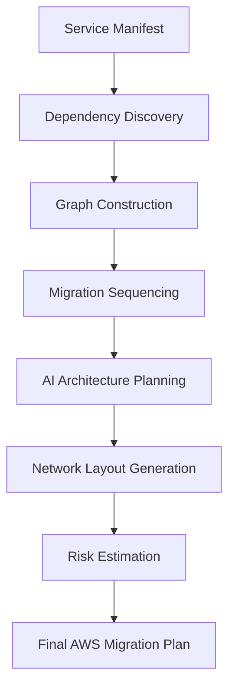

# 🌊 WaveSync AI — Migration Pipeline

The project automates the migration of legacy microservices to AWS through a serial process of discovery, planning, and execution.

## 🔁 End-to-End Flow

### 1. Discovery Phase
- **Ingestion**: Uploading the JSON manifest of existing microservices.
- **Dependency Detection**: Identifying service-to-service calls.

### 2. Planning Phase
- **DAG Building**: Validating that no circular dependencies exist.
- **Sequencing**: Sorting services according to priority and bottleneck potential ($S = P \times 0.7 + O \times 0.3$).

### 3. Transformation Phase
- **Classification**: Categorizing services into Stateful, Stateless, or Infrastructure.
- **Architecture Planning**: Mapping legacy tech (MySQL, Redis, Local Nginx) to AWS equivalents (RDS, ElastiCache, S3).
- **Network Layout**: Generating VPC, Subnet, and Load Balancer rules.

### 4. Risk Assessment
- **Weighted Scoring**: Evaluating the complexity based on the service's role and dependencies.

### 5. Final Output
A complete **Migration Blueprint** in JSON format, ready for the deployment layer.
